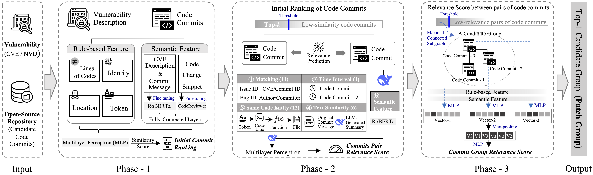

# Artifact for the Paper "Not Every Patch is an Island: LLM-Enhanced Identification of Multiple Vulnerability Patches"

## Overview



- **Phase-1: Initial Ranking**  
  - For a given vulnerability, using various features to extract its relevance to candidate code commits. A small part of highly-relevant code commits will be delivered to the next phase to be further checked.
  - Source code: **[Phase1-get-commit-info.py](Phase-1%20Initial%20Ranking/Phase1-get-commit-info.py)**, **[Phase1-rule-based-feature.py](Phase-1%20Initial%20Ranking/Phase1-rule-based-feature.py)**, and **[Phase1-initial-ranking.py](Phase-1%20Initial%20Ranking/Phase1-initial-ranking.py)**.
    
- **Phase-2: Commits Linkage Prediction**
  - Predicting the relevance score of any pair of highly-relevant code commits to quantitatively reflect whether these two are responsible for the same vulnerability. LLM-generated features as well as rule-based and semantic features participant in the prediction process.
  - Source code: **[Phase2-create_top_k_file.py](Phase-2%20Commits%20Linkage%20Prediction/Phase2-create_top_k_file.py)**, **[Phase2-interrelationship-feature.py](Phase-2%20Commits%20Linkage%20Prediction/Phase2-interrelationship-feature.py)**, **[Phase2-process-deepseek-answer.py](Phase-2%20Commits%20Linkage%20Prediction/Phase2-process-deepseek-answer.py)**, and **[Phase2-interrelationship-training.py](Phase-2%20Commits%20Linkage%20Prediction/Phase2-interrelationship-training.py)**.

- **Phase-3: Commit Group Forming and Ranking**
  - Labeling the pairs of code commits whose relevance score exceeds the preset threshold as relevant, and constructing maximum connected subgraphs from all relevant pairs. For each subgraph, performing max-pooling to the numeric vectors of the code commits it contains to produce a proxy vector. Finally, measuring the relevance between all proxy vectors and the vulnerability, the commit group with the highest-relevance proxy vector will be determined as the *patch group* and output.
  - Source code: **[Phase3-split-groups.py](Phase-3%20Commit%20Group%20Forming%20and%20Ranking/Phase3-split-groups.py)**, **[Phase3-get-each-commit-feature.py](Phase-3%20Commit%20Group%20Forming%20and%20Ranking/Phase3-get-each-commit-feature.py)**, and **[Phase3-group-ranking.py](Phase-3%20Commit%20Group%20Forming%20and%20Ranking/Phase3-group-ranking.py)**.

## Repository structure
```bash
├── *Dataset*
│   ├── CVE_info.csv  # 4,631 CVEs with their description information
│   ├── multi-patch_CVE_data.csv  # 1,560 CVEs with their patches   
│   ├── single-patch_CVE_data.csv  # 3,071 CVEs with their patch
│  
├── *Phase-1 Initial Ranking/*
│   ├── Phase1-Features.pdf  # rule-based features used in Phase-1
│   ├── Phase1-get-commit-info.py  # obtaining information of code commits
│   ├── Phase1-rule-based-feature.py  # extracting the rule-based features used in Phase-1
│   ├── Phase1-initial-ranking.py  # training the model and predicting the relevance between candidate code commits and the vulnerability
│       
├── *Phase-2 Commits Linkage Prediction/*
│   ├── Phase2-create_top_k_file.py  # selecting the top-k code commits of each vulnerability item
│   ├── Phase2-interrelationship-feature.py  # extracting the rule-based features used in Phase-2
│   ├── Phase2-process-deepseek-answer.py  # processing the answer of DeepSeek
│   ├── Phase2-interrelationship-training.py  # training the model and predicting the relevance scores of pairs of code commits
│
├── *Phase-3 Commit Group Forming and Ranking/*
│   ├── Phase3-split-groups.py  # forming groups of code commits based on the relevance scores
│   ├── Phase3-get-each-commit-feature.py  # extracting the rule-based features used in Phase-3       
│   ├── Phase3-group-ranking.py  # training the model and predicting the relevance score between each group and the vulnerability
│
├── *Running example/*  # a step-by-step description of SHIP by running an example vulnerability item
│   ├── Running example.pdf  
│   ├── Phase1-Output.csv
│   ├── Phase2-Output.csv 
│   ├── Phase3-Output.csv
│
├── *Link to Post*  # an existing report recording vulnerability descriptions' average length from 1988 to 2025
│
├── *Prompt.md*
│
├── *README.md*
│
├── *requirements.txt*  # requirements of running environment
```
